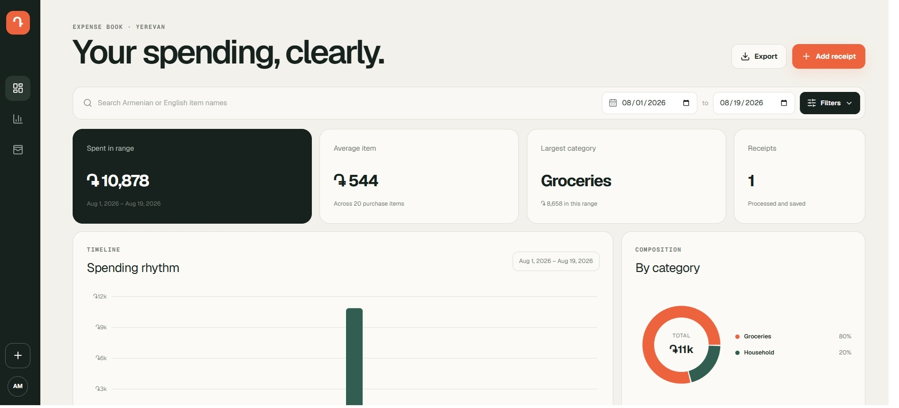
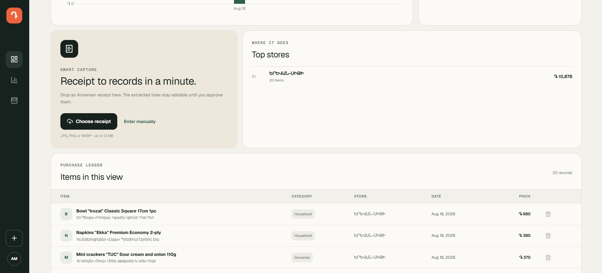
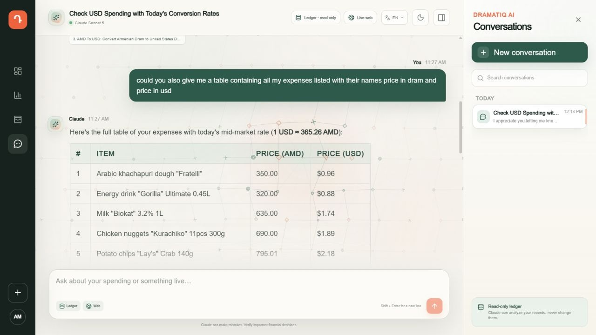

# Dramatiq

[](https://github.com/alitaghavizad/dramatiq-expense-visualizer/actions/workflows/ci.yml)

A local-first expense dashboard that turns Armenian and Russian receipt photos
into reviewed PostgreSQL records. Gemini extracts the receipt, you verify every
line, and the dashboard visualizes spending by time, category, store, and price.
An integrated Claude agent can analyze the saved ledger through read-only tools,
continue durable conversations, and search the live web when a question needs
current context.

## Screenshots

### Dashboard overview



### Receipt capture and sortable purchase ledger



### Claude expense chat



## Features

- Armenian and Russian receipt recognition with Google Gemini
- Review-before-save workflow—AI output is never inserted automatically
- One normalized PostgreSQL row per purchased item
- Date, category, store, price, and Armenian/English text filters
- Sortable expense columns with accessible ascending and descending controls
- Daily spending, category mix, top-store insights, and purchase ledger
- Manual entry, CSV export, duplicate-receipt protection, and deletion
- Claude Sonnet 5 expense chat with streamed responses and web citations
- Durable conversation history that can be reopened and continued
- Live per-conversation API cost estimates in the top bar and history cards, with a warning at every whole US dollar
- Constrained read-only ledger tools; the agent has no expense write operation
- Persistent light/dark themes and English, Armenian, and German UI languages
- Interactive shape-and-line backgrounds across the dashboard and chat
- Responsive desktop and mobile interface

Receipt images are processed in memory and are not stored by the application.
Only reviewed structured values, the source filename, and a SHA-256 hash are
saved. Images submitted for recognition are sent to the configured Gemini API.

## Technology

- React 19 and vinext/Vite
- Node.js and Express 5
- PostgreSQL 18
- Google Gemini Interactions API with JSON-schema output
- Anthropic Claude Messages API with custom database tools and web search
- Recharts for dashboard visualizations

The default recognition model is `gemini-3.7-flash`. Override it with
`GEMINI_MODEL` without changing application code.

The default chat model is `claude-sonnet-5`. Override it with `CLAUDE_MODEL`.
Claude web search runs only when the model determines that current external
information is useful; Anthropic may charge separately for each web search.
The chat cost display uses a server-side Sonnet 5 pricing snapshot and includes
input, output, cache, title-generation, and reported web-search usage. It is an
estimate; the Anthropic invoice remains authoritative.

## Run with Docker

### Requirements

- Docker Desktop
- An existing PostgreSQL server, or the optional bundled PostgreSQL service
- A [Gemini API key](https://aistudio.google.com/app/apikey)
- An [Anthropic API key](https://console.anthropic.com/settings/keys) for chat

### 1. Configure the application

Copy `.env.example` to `.env`, then set the database credentials and Gemini key:

```env
POSTGRES_USER=postgres
POSTGRES_PASSWORD=your-database-password
POSTGRES_DB=expense_visualizer
POSTGRES_HOST=localhost
DOCKER_POSTGRES_HOST=host.docker.internal
POSTGRES_PORT=5432
GEMINI_API_KEY=your-key-here
ANTHROPIC_API_KEY=your-anthropic-key-here
```

Never commit `.env` or paste an API key into an issue.

### 2. Start the app with an existing PostgreSQL container

The default Compose configuration connects from the app container to PostgreSQL
through `host.docker.internal`. This is the correct mode when PostgreSQL is
already published on your laptop's port `5432`.

```bash
docker compose up -d --build
```

The container creates or updates the database tables during startup. Open
[http://localhost:3000](http://localhost:3000); the API is available at
`http://localhost:3001`.

Useful lifecycle commands:

```bash
docker compose ps
docker compose logs -f app
docker compose restart app
docker compose down
```

`docker compose down` stops and removes only the application container. It does
not remove an independently managed PostgreSQL container or its data.

### Optional: run PostgreSQL in the same Compose project

First ensure port `5432` is not already used by another database container, then
run:

```bash
docker compose -f compose.yaml -f compose.bundled-db.yaml up -d --build
```

This creates a persistent `postgres-data` volume. A normal `docker compose down`
preserves the volume; adding `--volumes` deletes it and should only be used when
you intentionally want to erase the bundled database.

### Changing configuration

All local settings and secrets live in `.env`:

- Change `POSTGRES_USER`, `POSTGRES_PASSWORD`, `POSTGRES_DB`, and
  `POSTGRES_PORT` for database access.
- Change `DOCKER_POSTGRES_HOST` if the app container should reach PostgreSQL
  somewhere other than your laptop. Leave it as `host.docker.internal` for the
  current separately managed database container.
- Change `GEMINI_API_KEY` for Gemini authentication.
- Change `GEMINI_MODEL` to select another recognition model.
- Change `GEMINI_TIMEOUT_MS` if complex receipt images need more or less than
  the default 180 seconds for recognition.
- Change `ANTHROPIC_API_KEY` for Claude chat authentication.
- Change `CLAUDE_MODEL`, `CLAUDE_MAX_TOKENS`, `CLAUDE_TIMEOUT_MS`,
  `CLAUDE_WEB_MAX_USES`, or `CLAUDE_MAX_TOOL_ROUNDS` to tune the chat agent.
- Change `WEB_PORT`, `API_PORT`, `APP_ORIGIN`, and
  `NEXT_PUBLIC_EXPENSE_API_URL` when exposing the app on different ports.

After changing runtime settings or secrets, recreate the container:

```bash
docker compose up -d --force-recreate
```

When changing `NEXT_PUBLIC_EXPENSE_API_URL`, rebuild because that browser-facing
value is compiled into the frontend:

```bash
docker compose up -d --build --force-recreate
```

The `.env` file is injected only when the container starts. It is excluded from
both the Docker image and Git, so secrets are not baked into image layers.

## Native development

Install dependencies and initialize the database:

```bash
npm ci
npm run db:init
```

Then start the web app and API with live reload:

```bash
npm run dev
```

Open [http://localhost:3000](http://localhost:3000). The local API listens on
`127.0.0.1:3001` by default.

## Environment variables

| Variable | Required | Purpose |
| --- | --- | --- |
| `POSTGRES_USER` | No | Database username; defaults to `postgres` |
| `POSTGRES_PASSWORD` | No | Database password; defaults to `postgres` |
| `POSTGRES_DB` | No | Database name; defaults to `expense_visualizer` |
| `POSTGRES_HOST` | No | Database host; Compose overrides it for container networking |
| `DOCKER_POSTGRES_HOST` | No | Database host used by the app container; defaults to `host.docker.internal` |
| `POSTGRES_PORT` | No | Database port; defaults to `5432` |
| `DATABASE_URL` | No | Advanced connection-string override for all `POSTGRES_*` values |
| `GEMINI_API_KEY` | For scanning | Gemini API authentication |
| `GEMINI_MODEL` | No | Recognition model; defaults to `gemini-3.7-flash` |
| `GEMINI_TIMEOUT_MS` | No | Receipt-recognition timeout in milliseconds; defaults to `180000` |
| `ANTHROPIC_API_KEY` | For chat | Server-side Claude API authentication |
| `CLAUDE_MODEL` | No | Chat model; defaults to `claude-sonnet-5` |
| `CLAUDE_MAX_TOKENS` | No | Maximum generated tokens per Claude request; defaults to `4096` |
| `CLAUDE_TIMEOUT_MS` | No | Claude request timeout in milliseconds; defaults to `180000` |
| `CLAUDE_WEB_MAX_USES` | No | Maximum live searches per Claude request; defaults to `4` |
| `CLAUDE_MAX_TOOL_ROUNDS` | No | Maximum agent tool loops per answer; defaults to `8` |
| `API_HOST` | No | API bind address; defaults to `127.0.0.1` |
| `API_PORT` | No | API port; defaults to `3001` |
| `APP_ORIGIN` | No | Comma-separated allowed browser origins |
| `NEXT_PUBLIC_EXPENSE_API_URL` | No | Browser-facing API URL |
| `WEB_PORT` | No | Browser-facing web port; defaults to `3000` |

## Commands

| Command | Description |
| --- | --- |
| `npm run dev` | Start the web app and API with live reload |
| `npm run db:init` | Create or update the PostgreSQL schema |
| `npm run build` | Build the web app and compile the API |
| `npm start` | Run the previously built app and API |
| `npm run start:container` | Initialize the schema, then run the built app and API |
| `npm test` | Run project tests |
| `npm run lint` | Run static analysis |
| `npm run audit` | Check all dependencies for high-severity advisories |
| `npm run check` | Run lint, tests, build, and dependency audit |

## Data model

`receipts` stores receipt-level metadata and extraction provenance.
`expenses` stores one row per reviewed item, including:

- date and receipt relationship
- original Armenian name and optional English translation
- category, store, and quantity
- unit price, total price, and currency
- extraction confidence and timestamps

`chat_conversations` and `chat_messages` store the conversation list, complete
user/assistant history, web sources, detailed token usage, pricing snapshots,
per-message estimates, cumulative conversation cost, and the last displayed
whole-dollar warning. The full prior message history is replayed to Claude when
a conversation continues.

The complete idempotent schema is in [`database/schema.sql`](database/schema.sql).

## Security notes

- The API binds to localhost by default.
- Receipt uploads are restricted to JPG, PNG, and WEBP files under 12 MB.
- Scan requests are rate-limited and time out after 180 seconds by default.
- Claude receives only parameterized SELECT-based ledger tools; it cannot insert,
  update, or delete database records.
- Claude web search executes on Anthropic infrastructure and cited source links
  are stored with the assistant message.
- API keys stay server-side and `.env` files are ignored by Git.
- Docker injects `.env` at runtime; secrets are not copied into the image.
- The application image runs as an unprivileged Linux user.
- All dependencies are checked for high-severity advisories in CI.
